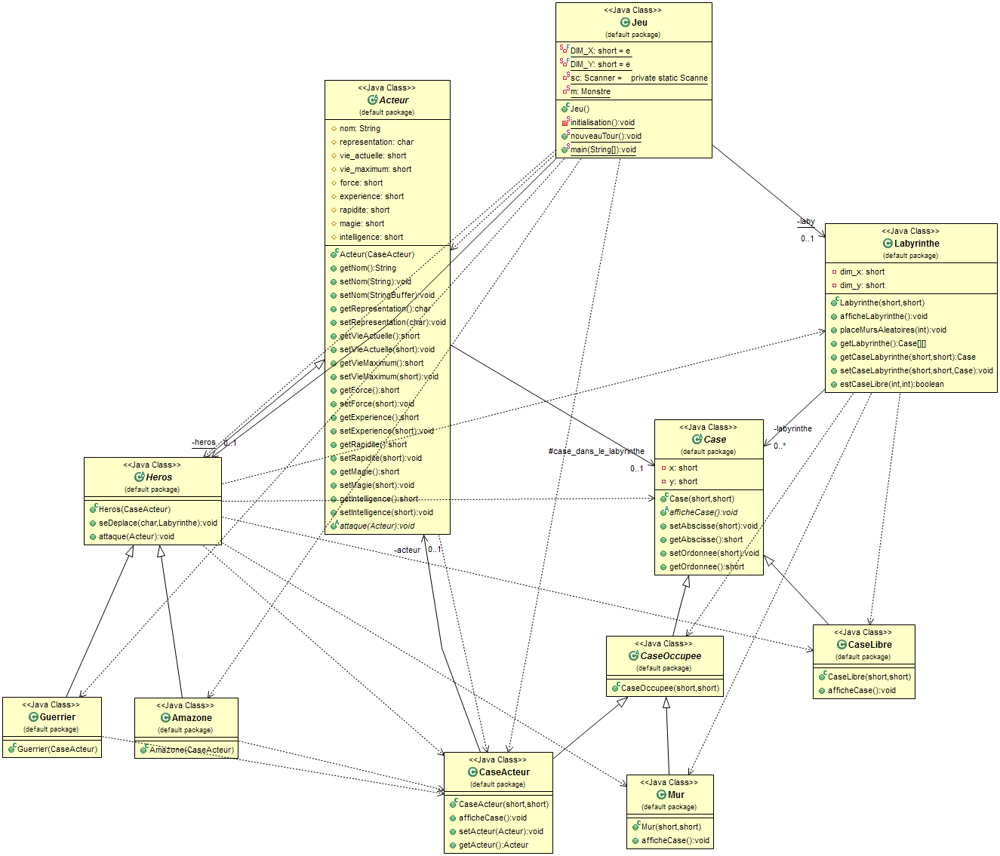
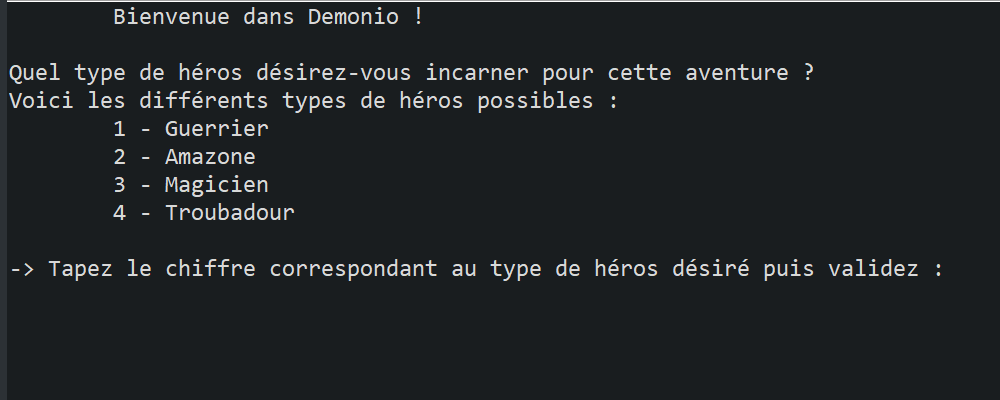
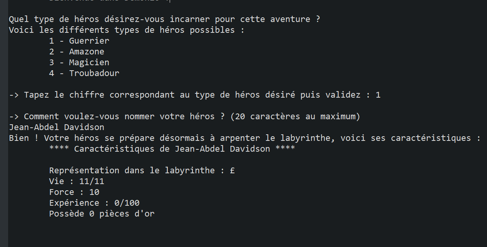
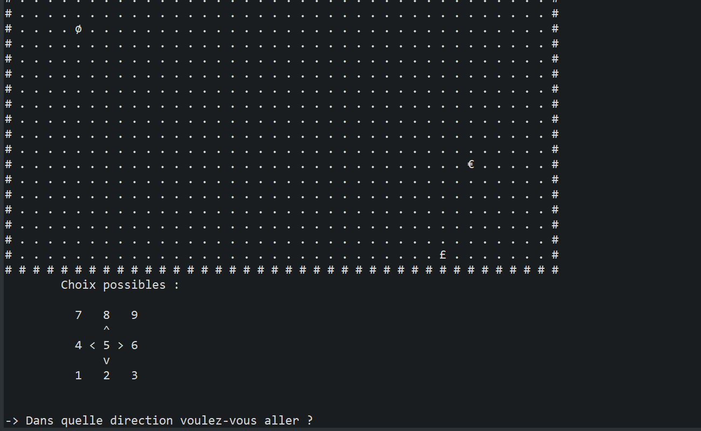
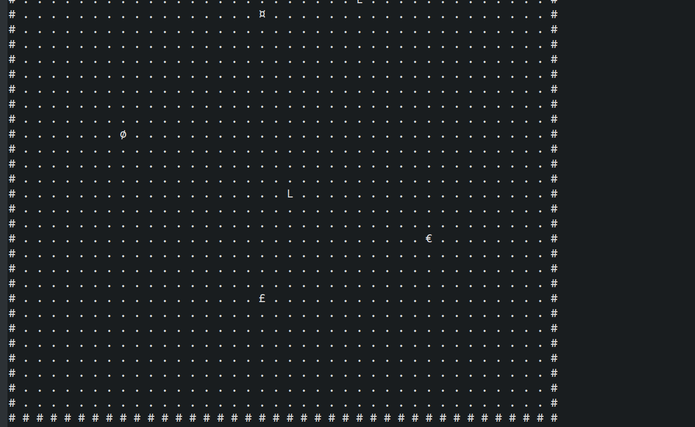
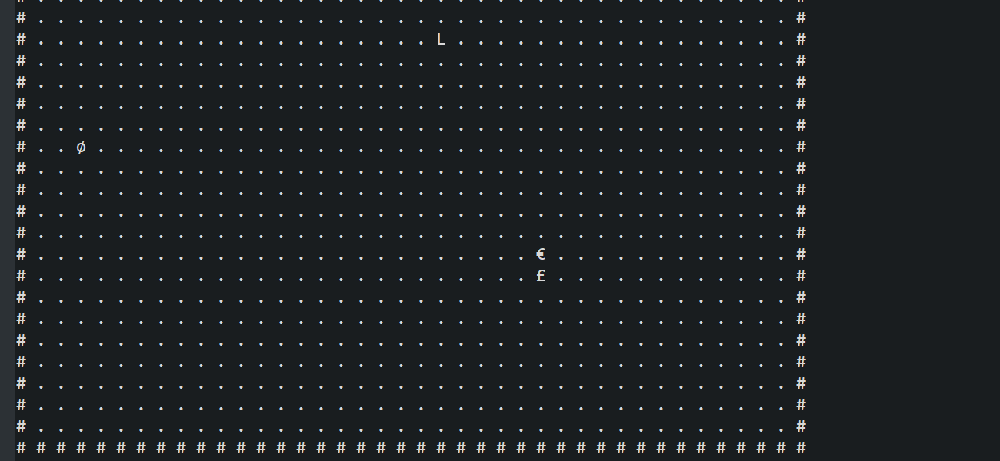
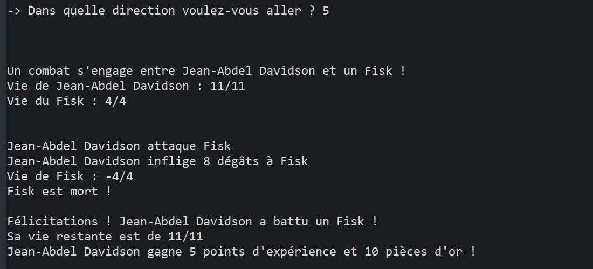
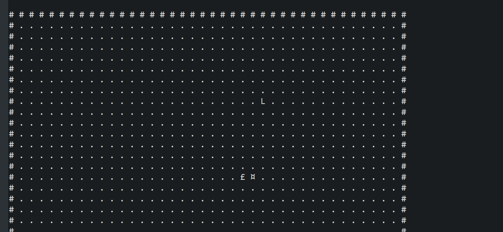
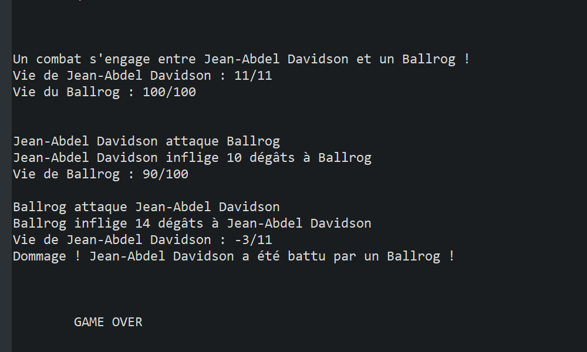

# Demonio

Jeu en console. Petit projet Java de semestre 2 décalé de DUT Informatique (Nancy Charlemagne, 2013)

## Choose your fighter to explore a maze and kill all the monsters !

* You earn gold and experience when you killed an enemy
* You can move in the maze using number as an input
* When an enemy is near you, he will start chasing you
* Fights are automatically solved

**Context :** University small project

**Type :** Rogue-like (turn-based)

**Platform :** System console, tested on Windows console

----

## In-game screenshots

